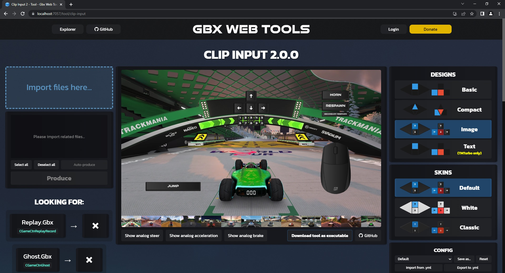

# Clip Input 2 [(online)](https://gbx.bigbang1112.cz/tool/clip-input)

[](https://github.com/BigBang1112-cz/clip-input/releases)
[](https://github.com/BigBang1112-cz/clip-input/releases)

Hosted on [Gbx Web Tools](https://github.com/bigbang1112-cz/gbx), lives on [Gbx Tool API](https://github.com/bigbang1112-cz/gbx-tool-api), internally powered by [GBX.NET](https://github.com/BigBang1112/gbx-net).

**Clip Input** is a tool that can extract inputs from replays **and create a MediaTracker visualization as .Clip.Gbx** which can be then imported next to the replay.

New features of Clip Input 2:
- TM2020 input support
- ShootMania input support
- TMTurbo support
- Multiple design+skin support
- Action keys support
- Mouse support
- Respawn/Horn/Jump support
- Better device switch visuals
- Analog value text visualization
- Every crucial feature of Clip Input 1

### All Trackmania and Shootmania games are supported!



Possible uses of Clip Input:
- Inspect other player's solutions
- Inspect very old replays reaching 2003
- Input visualization for map GPS
- Save time rendering the input visualization

Advantages of Clip Input over other input inspection methods:
- No video rendering is required to showcase the inputs
- Compatibility of replays across the whole Trackmania franchise
- Currently it's the fastest method to check inputs in Trackmania 2
- Inputs can be rendered together with the clip

Currently the tool can read inputs from these files:
- Replay.Gbx
- Ghost.Gbx
- Clip.Gbx (that contains minimally 1 ghost)

Where can I import the outputted Clip.Gbx?
- For replays as old as TM1.0-TMUF, it is recommended to import the clip in the latest version of Trackmania United Forever.
- For replays from TM2, it is recommended to import the clip in the latest version of ManiaPlanet.

## Trackmania Turbo

As Trackmania Turbo still does not support images and triangles, a wild solution had to be made. The visualization is now purely generated with text! This can be enabled by selecting the Text design in web UI or by setting `DesignId: Text`.

## Troubleshooting

- Issue: The analog input is white instead of blue
  - Solution: Analog input is made out of 2D triangles which become always white on PC2 shader quality. To fix this, **set the Shader Quality to at least PC3 Low**.
- Issue: Some digital inputs aren't appearing in a rendered video
  - Solution: The tap was so fast that it didn't fit inside the video framerate. Luckily this can be solved with `AdjustToFPS` setting which ensures that each activated state is at least 1/`FPS` seconds long.

## Settings

Configuration can be managed on the website in the Config component or inside the `Config` folder.

You can now have multiple configs and change between them.

```yml
# Updated 5. 5. 2023, can change over time
AspectRatio: [16, 9]
StartOffset: 0 # Offset in seconds when to start the input visualization
ActiveColor: [0.2, 0.6, 0.9, 1]
InactiveColor: [0.1, 0.1, 0.1, 1]
BrakeColor: [0.9, 0.3, 0.2, 1]
InterpTolerance: 0.0001 # Length of a transition between an input change (if represented by triangles). It should stay very low.
DefaultDevice: Keyboard
AdjustToFPS: false # Important for videomakers. It makes sure activated state is at least 1 frame long.
FPS: 30 # Framerate for AdjustToFPS, otherwise unused
PrimaryPos: [0, 0.55] # Position of the main inputs visualizer (gas and steer)
PrimaryScale: [0.8, 0.8] # Scale of the main inputs visualizer (gas and steer)
AnalogSteerPos: [0, 0]
AnalogSteerSpacing: [0.11, 0]
AnalogSteerSize: [0.4, 0.4]
DigitalSteerPos: [0, -0.2]
DigitalSteerSpacing: [0.11, 0]
DigitalSteerSize: [0.19, 0.19]
AnalogAccelPos: [0, 0.105]
AnalogAccelSize: [0.19, 0.19]
DigitalAccelPos: [0, 0.105]
DigitalAccelSize: [0.19, 0.19]
AnalogBrakePos: [0, -0.105]
AnalogBrakeSize: [0.19, 0.19]
DigitalBrakePos: [0, -0.105]
DigitalBrakeSize: [0.19, 0.19]
EnableAnalogSteerValue: true # Shows text values of analog steering
EnableAnalogAccelValue: true # Shows text values of analog accel
EnableAnalogBrakeValue: true # Shows text values of analog brake
AnalogSteerValueScale: [0.75, 0.75]
AnalogSteerValueOffset: [0.5, 0]
AnalogSteerValueColor: [1, 1, 1]
AnalogAccelValueScale: [0.6, 0.6]
AnalogAccelValueOffset: [-0.005, 0.17]
AnalogAccelValueColor: [1, 1, 1]
AnalogBrakeValueScale: [0.6, 0.6]
AnalogBrakeValueOffset: [-0.005, -0.15]
AnalogBrakeValueColor: [1, 1, 1]
AnalogValueTextFormat: $s$o$n{0}
AnalogValueNumberFormat: 0.00 # Change this to P0 if you prefer percentages
EnableMouse: true
EnableMouseMovement: true # If the mouse should move according to tracked mouse movements or stay still regardless
MousePos: [-0.65, -0.35]
MouseScale: [0.8, 0.8]
EnableActionKeys: true
ActionKeysPos: [0, 0.34]
ActionKeysScale: [0.15, 0.15]
ActionKeysSpacing: [0.5, 0.5]
ActionKeysTextColor: [1, 1, 1]
ActionKeysTextFormat: $o$n{0}
EnableJump: true
JumpScale: [1.5, 1.5]
JumpPos: [0.6, -0.6]
EnableHorn: true
HornScale: [0.75, 0.75]
HornPos: [-0.65, 0.65]
EnableRespawn: true
RespawnScale: [0.75, 0.75]
RespawnPos: [-0.65, 0.5]
EnableSecondaryRespawn: true
SecondaryRespawnScale: [0.5, 0.5]
SecondaryRespawnPos: [-0.65, 0.39]
KeyTapPressTime: 200
Formatting: '' # Formatting of analog text values
DesignId: Basic # Can be Basic, Compact, Image, Text
SkinId: '' # Can be Default, LoveTAS for Basic and Compact, can be Default, White, Classic for Image
PreferManiaPlanet: false # If to prefer image references to ManiaPlanet Documents folder structure
```

## CLI build

For 100% offline control, you can use the CLI version of Clip Input 2. Drag and drop your desired replays onto the ClipInputCLI(.exe).

### ConsoleOptions.yml

- **NoPause** - If true, All "Press key to continue..." will be skipped.
- **SingleOutput** - If false, dragging multiple files will produce multiple results. If true, multiple files will produce only one result.
- **CustomConfig** - Name of the config inside the `Config` folder without the extension.
- **OutputDir** - Forced output directory of produced results.

Location where the game exe is (you will be asked for it if ConsoleOptions.yml does not exist):

- **TrackmaniaForeverInstallationPath**
- **ManiaPlanetInstallationPath**
- **TrackmaniaTurboInstallationPath** 
- **Trackmania2020InstallationPath**

### Update notifications

The tool notifies you about new versions after launching it. You can press U to directly open the web page where you can download the new version. For security reasons, auto-updater is not planned atm.

### Update assets

You can update assets with execution of `UpdateAssets.bat` or `UpdateAssets.sh`. In case of Clip Input 2, this includes image assets.

### Specific command line arguments

- `-nopause`
- `-singleoutput`
- `-config [ConfigName]`
- `-o [OutputDir]` or `-output [OutputDir]`
- `-updateassets` - Included in UpdateAssets.bat/sh
- `-c:[AnySettingName] [value]` - Force setting through the command line, **currently works only for string values.**
